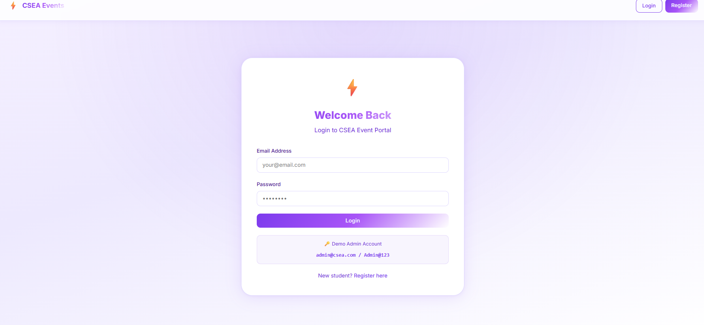
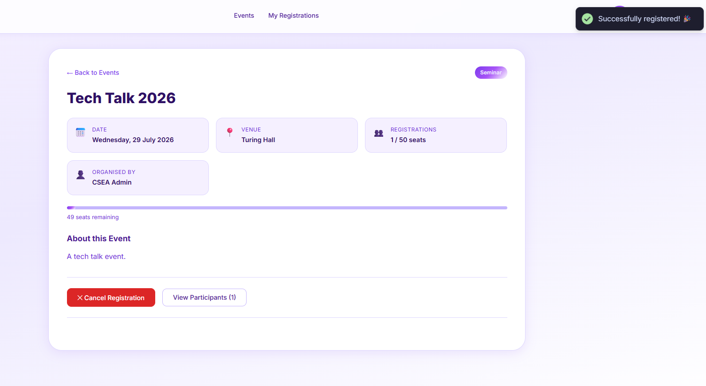
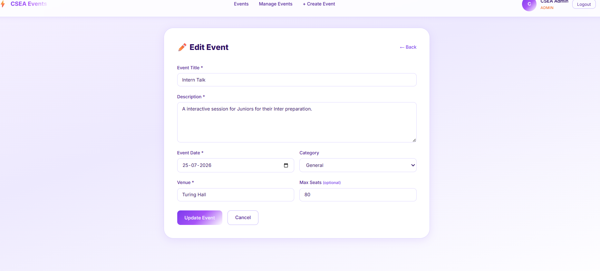
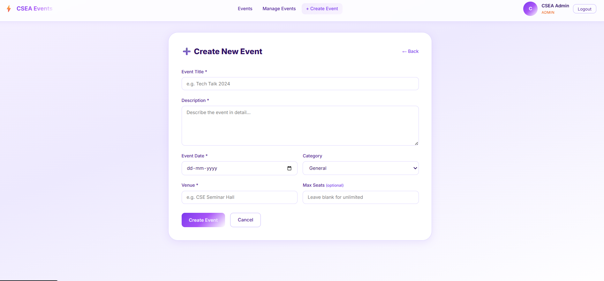
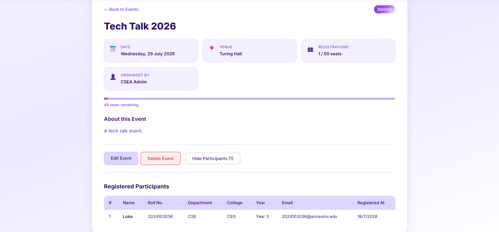
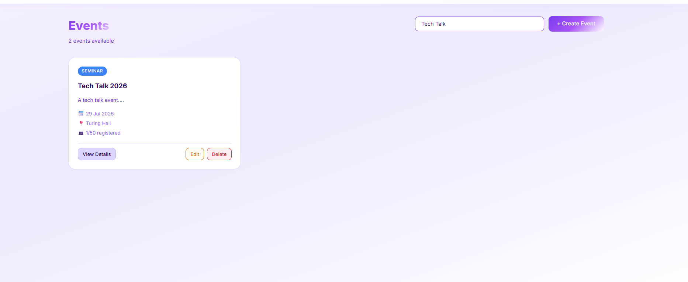

# CSEA Event Management System

A full-stack Event Management System developed for the Computer Science & Engineering Association (CSEA) to manage events and student registrations. Features include robust JWT authentication, role-based access control (Student vs. Admin), dynamic dashboards, and input validation.

---

##  Screenshots & Demo Video

###  Demo Video
<!-- Replace 'path/to/demo_video.mp4' with the actual path or URL of your video -->


*Alternatively, embed a local MP4 file:*
```html
<video src="assets/demo_video.mp4" width="100%" controls></video>
```

###  App Screenshots
| Registration & Login | Student Events Portal |
| | 

| Student Dashboard | 
|  

| Event Details & Participants | Create/Edit Event Form | View Participants | Search Events
|  |  |  
| 

---
### Code
index.js
| |

Models
| | | 

## 🛠️ Tech Stack

### Backend
- **Runtime Environment:** Node.js (v24+)
- **Framework:** Express.js
- **Authentication:** JWT (JSON Web Tokens) & `bcryptjs` password hashing
- **Validation:** `express-validator` middleware
- **Development Tooling:** `nodemon` for hot-reloads

### Frontend
- **Library:** React.js (Vite template)
- **Routing:** React Router DOM (v6)
- **HTTP Client:** Axios with request interceptor for automated JWT injection
- **UI Notifications:** React Hot Toast
- **Design System:** Custom Vanilla CSS with a modern, colorful light purple and white gradient theme.

---

## 💾 Database Design (MongoDB & Mongoose)

We use MongoDB as the database with Mongoose ODM. It consists of three primary collections:

### 1. Student (`Student` Model)
Represents registered students and administrators.
- `name` (String, Required)
- `email` (String, Required, Unique, Lowercase)
- `password` (String, Required, Hidden from queries by default)
- `rollNumber` (String, Required, Unique)
- `department` (String, Required)
- `college` (String, Required)
- `year` (Number, Required, 1-4)
- `role` (String, enum: `['student', 'admin']`, default: `'student'`)

### 2. Event (`Event` Model)
Represents association events managed by admins.
- `title` (String, Required)
- `description` (String, Required)
- `date` (Date, Required)
- `venue` (String, Required)
- `maxSeats` (Number, Optional)
- `category` (String, default: `'General'`)
- `createdBy` (ObjectId referencing `Student`, Required)

### 3. Registration (`Registration` Model)
Acts as a junction table between Students and Events.
- `student` (ObjectId referencing `Student`, Required)
- `event` (ObjectId referencing `Event`, Required)
- **Compound Unique Index:** `(student, event)` is indexed as unique. This guarantees a student cannot register for the same event multiple times.

---

## 🚀 Setup and Execution Instructions

### Prerequisites
- Install [Node.js](https://nodejs.org/) (v18 or higher recommended).
- Install [MongoDB Community Server](https://www.mongodb.com/try/download/community) locally and ensure it is running on the default port `27017` (e.g. `mongodb://localhost:27017`).

---

### Step 1: Backend Setup
1. Open a terminal and navigate to the `server/` directory:
   ```bash
   cd server
   ```
2. Install dependencies:
   ```bash
   npm install
   ```
3. Configure the environment variables:
   Ensure you have a `.env` file in the `server/` directory with the following contents:
   ```env
   PORT=2007
   MONGO_URI=mongodb://localhost:27017/csea_events
   JWT_SECRET=csea_super_secret_jwt_key_2024
   JWT_EXPIRES_IN=7d
   ```
4. **Seed the default Admin Account:**
   Run the seeding script to create the initial admin user:
   ```bash
   npm run seed
   ```
   *Admin Credentials created:*
   - **Email:** `admin@csea.com`
   - **Password:** `Admin@123`

5. Start the backend development server:
   ```bash
   npm run dev
   ```
   The backend will start running on **`http://localhost:2007`**.

---

### Step 2: Frontend Setup
1. Open a second terminal window/tab and navigate to the `client/` directory:
   ```bash
   cd client
   ```
2. Install dependencies:
   ```bash
   npm install
   ```
3. Start the Vite React development server:
   ```bash
   npm run dev
   ```
   The frontend will start running on **`http://localhost:5173`**.

---

## 📡 API Documentation

All request payloads should have the `Content-Type: application/json` header. Protected routes require a bearer token in the `Authorization` header: `Bearer <token>`.

### Authentication Endpoints

#### 1. Register Student
- **Endpoint:** `POST /api/auth/register`
- **Access:** Public
- **Request Body:**
  ```json
  {
    "name": "John Doe",
    "email": "john@example.com",
    "password": "password123",
    "rollNumber": "21CS045",
    "department": "CSE",
    "college": "Sri Venkateswara College of Engineering",
    "year": 3
  }
  ```
- **Response (201 Created):**
  ```json
  {
    "success": true,
    "token": "eyJhbGciOi...",
    "student": {
      "id": "603f...",
      "name": "John Doe",
      "email": "john@example.com",
      "rollNumber": "21CS045",
      "college": "Sri Venkateswara College of Engineering",
      "department": "CSE",
      "year": 3,
      "role": "student"
    }
  }
  ```

#### 2. Login Student
- **Endpoint:** `POST /api/auth/login`
- **Access:** Public
- **Request Body:**
  ```json
  {
    "email": "john@example.com",
    "password": "password123"
  }
  ```
- **Response (200 OK):** Returns the same payload structure as Register Student.

---

### Events Endpoints

#### 3. Create Event
- **Endpoint:** `POST /api/events`
- **Access:** Private (Admin Only)
- **Request Body:**
  ```json
  {
    "title": "Hackathon 2026",
    "description": "24-hour coding challenge hosted by CSEA.",
    "date": "2026-08-15T09:00:00.000Z",
    "venue": "CSE Labs 1 & 2",
    "maxSeats": 100,
    "category": "Hackathon"
  }
  ```
- **Response (201 Created):**
  ```json
  {
    "success": true,
    "event": {
      "id": "604a...",
      "title": "Hackathon 2026",
      "description": "24-hour coding challenge hosted by CSEA.",
      "date": "2026-08-15T09:00:00.000Z",
      "venue": "CSE Labs 1 & 2",
      "maxSeats": 100,
      "category": "Hackathon",
      "createdBy": "603f..."
    }
  }
  ```

#### 4. Get All Events
- **Endpoint:** `GET /api/events`
- **Access:** Private (Student & Admin)
- **Response (200 OK):**
  ```json
  {
    "success": true,
    "count": 1,
    "events": [
      {
        "_id": "604a...",
        "title": "Hackathon 2026",
        "description": "24-hour coding challenge...",
        "date": "2026-08-15T09:00:00.000Z",
        "venue": "CSE Labs 1 & 2",
        "maxSeats": 100,
        "category": "Hackathon",
        "createdBy": {
          "_id": "603f...",
          "name": "CSEA Admin",
          "email": "admin@csea.com"
        },
        "registrationCount": 5
      }
    ]
  }
  ```

#### 5. Get Event by ID
- **Endpoint:** `GET /api/events/:id`
- **Access:** Private (Student & Admin)
- **Response (200 OK):** Returns the event details, `registrationCount`, and whether the requesting user is already registered (`isRegistered: true|false`).

#### 6. Update Event
- **Endpoint:** `PUT /api/events/:id`
- **Access:** Private (Admin Only)
- **Request Body:** Fields to update (e.g. `title`, `description`, `venue`, etc.)
- **Response (200 OK):** Returns the updated event object.

#### 7. Delete Event
- **Endpoint:** `DELETE /api/events/:id`
- **Access:** Private (Admin Only)
- **Response (200 OK):**
  ```json
  {
    "success": true,
    "message": "Event deleted successfully."
  }
  ```
  *Note: Deleting an event performs a cascade delete to remove all associated registrations automatically.*

---

### Registrations Endpoints

#### 8. Register for an Event
- **Endpoint:** `POST /api/events/:id/register`
- **Access:** Private (Student Only)
- **Response (201 Created):**
  ```json
  {
    "success": true,
    "message": "Successfully registered for the event.",
    "registration": {
      "_id": "605c...",
      "student": "603f...",
      "event": "604a..."
    }
  }
  ```

#### 9. Cancel Registration (Unregister)
- **Endpoint:** `DELETE /api/events/:id/register`
- **Access:** Private (Student Only)
- **Response (200 OK):**
  ```json
  {
    "success": true,
    "message": "Successfully unregistered from the event."
  }
  ```

#### 10. View Registered Participants for an Event
- **Endpoint:** `GET /api/events/:id/participants`
- **Access:** Private (Student & Admin)
- **Response (200 OK):**
  ```json
  {
    "success": true,
    "event": {
      "id": "604a...",
      "title": "Hackathon 2026"
    },
    "count": 1,
    "participants": [
      {
        "_id": "603f...",
        "name": "John Doe",
        "email": "john@example.com",
        "rollNumber": "21CS045",
        "department": "CSE",
        "college": "Sri Venkateswara College of Engineering",
        "year": 3,
        "registeredAt": "2026-07-18T12:00:00.000Z"
      }
    ]
  }
  ```

#### 11. View My Registrations
- **Endpoint:** `GET /api/registrations/my`
- **Access:** Private (Student Only)
- **Response (200 OK):**
  ```json
  {
    "success": true,
    "count": 1,
    "registrations": [
      {
        "registrationId": "605c...",
        "registeredAt": "2026-07-18T12:00:00.000Z",
        "event": {
          "_id": "604a...",
          "title": "Hackathon 2026",
          "date": "2026-08-15T09:00:00.000Z",
          "venue": "CSE Labs 1 & 2"
        }
      }
    ]
  }
  ```
